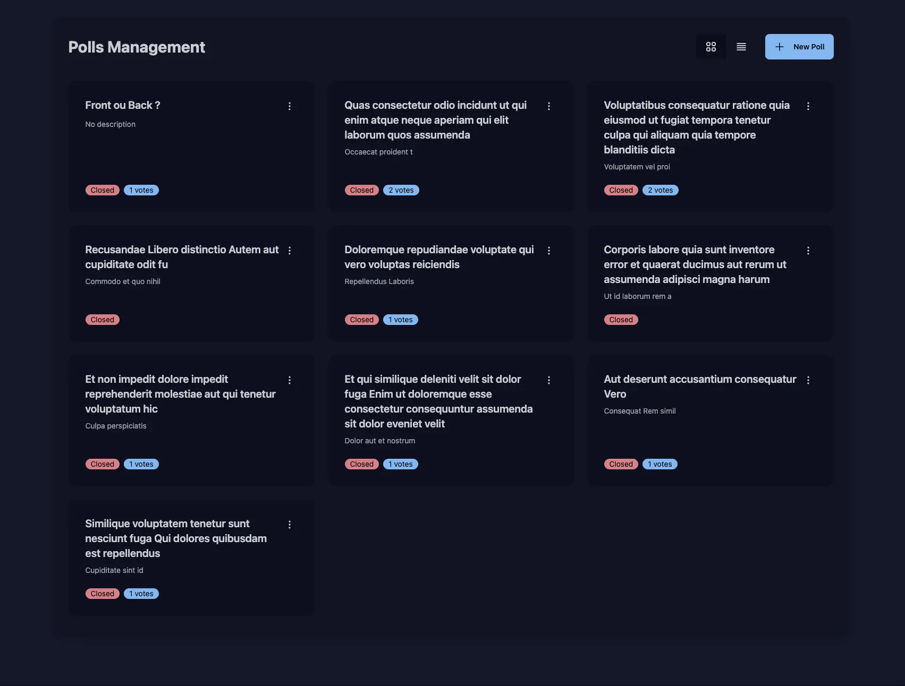

# OpenStreamPoll

OpenStreamPoll is an open-source live polling platform designed specifically for streamers. It enables real-time audience engagement through interactive polls, featuring instant results and seamless integration with popular streaming tools.



---

## Table of Contents
- [OpenStreamPoll](#openstreampoll)
  - [Table of Contents](#table-of-contents)
  - [Key Features](#key-features)
  - [Usage Guide](#usage-guide)
    - [Creating and Managing Polls](#creating-and-managing-polls)
    - [OBS Integration](#obs-integration)
      - [Real-Time Poll Display](#real-time-poll-display)
      - [QR Code Display](#qr-code-display)
      - [OBS Dock Integration](#obs-dock-integration)
  - [Installation \& Deployment](#installation--deployment)
    - [Prerequisites](#prerequisites)
    - [1. Production Deployment with Make (Recommended)](#1-production-deployment-with-make-recommended)
    - [2. Manual Production Deployment](#2-manual-production-deployment)
    - [3. Local Development Setup](#3-local-development-setup)
    - [4. Quick Local Testing](#4-quick-local-testing)
  - [Technologies](#technologies)
    - [Backend](#backend)
    - [Frontend](#frontend)
    - [Infrastructure](#infrastructure)
  - [Support \& Contributing](#support--contributing)
  - [About the Project](#about-the-project)
  - [License](#license)

---

## Key Features

- **Instant Live Polls**
  - Create polls in seconds with customizable options
  - Support for multiple choice questions (5 max)
  - Set poll duration and voting limits
  - Save polls as drafts for later use

- **Real-Time Engagement**
  - Live result updates
  - Dynamic vote counting
  - Interactive audience participation

- **Streaming Integration**
  - Native OBS integration
  - Overlay support

- **Security & Reliability**
  - Anti-vote manipulation protection
  - Rate limiting
  - IP-based and browser vote tracking

- **User Experience**
  - Responsive design for all devices
  - Intuitive admin interface

- **Deployment Options**
  - Docker-ready configuration
  - Easy scaling capabilities
  - Simple installation process

---

## Usage Guide

### Creating and Managing Polls

1. **Create a New Poll:**
   - Log in to the admin interface
   - Click "Create New Poll"
   - Set your question and options
   - Configure poll settings (duration, limits, etc.)
   - Save as draft or publish immediately

2. **Managing Drafts:**
   - Save polls as drafts for future streams
   - Edit drafts anytime before publishing

3. **Share with Audience:**
   - Copy the generated poll URL
   - Share through your preferred platform
   - Or use the OBS integration for direct display

4. **Monitor Activity:**
   - Watch real-time voting statistics
   - View participation metrics
   - Track engagement levels

5. **Display Results:**
   - Use the OBS overlay feature
   - Display the poll only during its open duration
   - The poll disappears and reappears automatically

### OBS Integration

#### Real-Time Poll Display
To display live polls in your stream:
1. Add a Browser Source in your OBS scene
2. Set the URL to: `https://yourdomain.com/obs`
3. Adjust the size and position as needed

#### QR Code Display
To show a QR code linking to the active poll:
1. Add another Browser Source in your OBS scene
2. Set the URL to: `https://yourdomain.com/obs/qr`
3. The QR code will automatically update when a new poll becomes active
4. Viewers can scan the QR code with their mobile devices to access the current poll

#### OBS Dock Integration
Manage polls directly from OBS:
1. Go to OBS menu: `View > Docks > Custom Browser Docks`
2. Add a new dock with:
   - Dock Name: "OpenStreamPoll"
   - URL: `https://yourdomain.com/admin`
3. The poll management interface will now be available directly in your OBS window

---

## Installation & Deployment

### Prerequisites

- PHP 8.3+
- Composer
- Symfony CLI
- SQLite
- Make
- Docker (optional, but recommended)

### 1. Production Deployment with Make (Recommended)

This method automatically creates and configures your production environment:

1. **Clone the Repository:**
   ```bash
   git clone https://github.com/yoanbernabeu/OpenStreamPoll.git
   cd OpenStreamPoll
   ```

2. **Deploy:**
   ```bash
   make deploy
   ```
   This command will:
   - Create a `compose.prod.yaml` from `compose.yaml`
   - Prompt for your domain name (use `:80` for no SSL)
   - Start the containers
   - Create and setup the database
   - Prompt for admin user credentials and create the account

The application will be accessible based on your SERVER_NAME configuration.

### 2. Manual Production Deployment

If you prefer to handle the deployment steps manually:

1. **Clone and Setup:**
   ```bash
   git clone https://github.com/yoanbernabeu/OpenStreamPoll.git
   cd OpenStreamPoll
   ```

2. **Create Production Configuration:**
   ```bash
   # Create production compose file
   cp compose.yaml compose.prod.yaml
   ```

3. **Configure Domain:**
   Edit `compose.prod.yaml` and set your domain in SERVER_NAME:
   ```yaml
   environment:
     - APP_ENV=prod
     - SERVER_NAME=yourdomain.com  # Use :80 for no SSL
   ```

4. **Start Services:**
   ```bash
   docker compose -f compose.prod.yaml up -d
   ```

5. **Setup Database:**
   ```bash
   # Create database
   docker compose -f compose.prod.yaml exec openstreampoll php bin/console doctrine:database:create
   
   # Run migrations
   docker compose -f compose.prod.yaml exec openstreampoll php bin/console doctrine:migrations:migrate --no-interaction
   ```

6. **Create Admin User:**
   ```bash
   docker compose -f compose.prod.yaml exec openstreampoll php bin/console app:create-user <username> <password>
   ```

The application will be accessible at your configured domain.

### 3. Local Development Setup

For local development with hot-reload and debugging:

1. **Initial Setup:**
   ```bash
   make first-install
   ```
   This will:
   - Install Composer dependencies
   - Install NPM packages
   - Create database
   - Start the development server

2. **Regular Development:**
   ```bash
   make start
   ```
   This will:
   - Run database migrations
   - Start Symfony server
   - Open the application in your browser
   - Watch Tailwind CSS changes

3. **Other Useful Commands:**
   ```bash
   make stop          # Stop the development server
   make reset-db      # Reset the database (with confirmation)
   make tests         # Run test suite
   make before-commit # Run all quality checks
   ```

### 4. Quick Local Testing

For rapid testing with Docker:

1. **Start the container:**
   ```bash
   docker run -d -p 80:80 \
     -e SERVER_NAME=:80 \
     -e APP_ENV=prod \
     --name openstreampoll \
     yoanbernabeu/openstreampoll:latest
   ```

2. **Setup database:**
   ```bash
   # Create database
   docker exec openstreampoll php bin/console doctrine:database:create
   
   # Run migrations
   docker exec openstreampoll php bin/console doctrine:migrations:migrate --no-interaction
   
   # Create admin user
   docker exec openstreampoll php bin/console app:create-user <username> <password>
   ```

The application will be accessible at `http://localhost`

---

## Technologies

### Backend
- **PHP 8.3** with Symfony 7.2
- **FrankenPHP** for high-performance PHP serving
- **SQLite** for simple, file-based database

### Frontend
- **Alpine.js** for reactive components
- **HTMX** for dynamic updates
- **Tailwind CSS** for styling
- **Fireworks-js** for celebration effects

### Infrastructure
- **Docker** with multi-stage builds
- **Composer** for PHP dependencies
- **Node.js** for asset building
- **Make** for automation

The stack is intentionally chosen to be simple yet effective, focusing on:
- Minimal dependencies
- Easy deployment
- Real-time capabilities
- Low resource usage

All of these technologies work together to create a lightweight, performant polling system that just works.

---

## Support & Contributing

This is a personal project that I've developed for my own streaming needs. I've made it open-source in case it might be useful to others, but please note:

- The application is intentionally simple and minimalistic, designed specifically for my use case
- I may not have time to review pull requests or handle feature requests regularly
- While you're welcome to fork and adapt it to your needs, this is primarily a personal tool

If you still want to report issues or suggest improvements:
- For bugs: Feel free to open an issue on GitHub
- For questions: Check existing issues or create a new one
- For security concerns: Contact me directly

## About the Project

OpenStreamPoll was created to solve a specific need in my streaming setup. Its simplicity is intentional, focusing on core polling functionality without unnecessary complexity. While it may not have all the features of larger polling platforms, it does exactly what I need it to do.

Thank you for your interest in this project! Feel free to use it, fork it, or draw inspiration from it for your own streaming tools.

## License

OpenStreamPoll is open-source software licensed under the [MIT License](LICENSE).